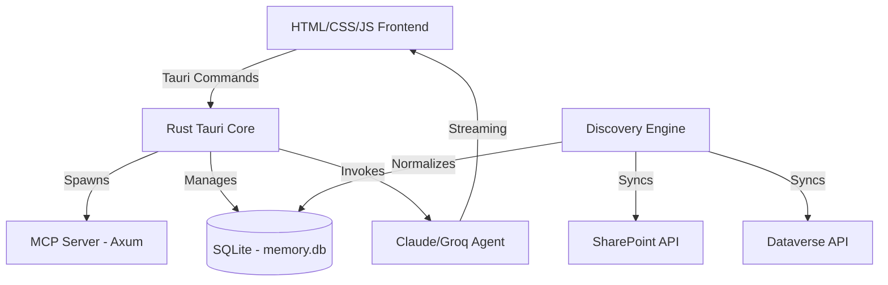

# Business Requirements Document: Nexus Server

**Version**: 1.0.0  
**Status**: Draft  
**Project Lead**: Antigravity (AI Architect)

---

## 1. Executive Summary
Nexus Server is a production-ready, local-first AI workspace designed to bridge the gap between enterprise data silos and modern AI document intelligence. Built with a high-performance Rust core and a premium Tauri interface, Nexus Server enables knowledge workers to discover, analyze, and gain insights from heterogeneous data sources like Microsoft SharePoint and Dataverse through a unified, "Orange & Black" themed interface.

The project prioritizes **privacy**, **speed**, and **intelligence**, ensuring that enterprise data is indexed locally and processed using state-of-the-art LLMs (Claude/Groq) with streaming capabilities.

## 2. Project Objectives
- **Centralized Document Intelligence**: Provide a single pane of glass for data stored across M365 and Power Platform.
- **Agentic Automation**: Leverage AI agents to perform complex document analysis, anomaly detection, and summarization.
- **Local-First Security**: Maintain data sovereignty by indexing and storing normalized records in a local SQLite vector store.
- **Premium User Experience**: Deliver a high-end, responsive UI that simplifies complex data relationships through modern design standards (Glassmorphism, AOS animations).

## 3. Stakeholders
| Stakeholder | Role / Interest |
| :--- | :--- |
| **Project Sponsors** | Strategic oversight and ROI on AI efficiency tools. |
| **Enterprise IT Admins** | Responsible for authentication configuration, API access, and local node management. |
| **Knowledge Workers** | Primary end-users utilizing the Explorer and Analysis panels for daily tasks. |
| **Security & Compliance** | Ensuring AES-256 standards and local data persistence meet organizational policies. |
| **DevOps** | Managing the local node orchestration and server lifecycle. |

## 4. Target Audience & Use Cases
### Target Audience
- Data Analysts and Researchers.
- Project Managers overseeing M365 ecosystems.
- Enterprise Developers building MCP-compliant tools.

### Key Use Cases
1. **Cross-Silo Discovery**: Finding a specific contract in SharePoint while comparing its financial terms with a record in Dataverse.
2. **Cognitive Summarization**: Generating a deep dive analysis of a 100-page technical document in seconds.
3. **Anomalies Detection**: identifying inconsistencies in normalized enterprise data sets.
4. **Local MCP Hosting**: Using the integrated server as a context provider for other AI tools.

---

## 5. Functional Requirements
### 5.1 Identity & Authentication
- **Microsoft Login**: Integration with organization Microsoft accounts for workspace access.
- **Identity Gating**: Soft-gate mechanism that restricts access to the Sidebar and Dashboard sections until identity is verified.
- **Session Management**: Secure persistence of authentication states throughout the application lifecycle.

### 5.2 Nexus Explorer
- **Normalized Data Grid**: A unified table for records, files, and list items from disparate sources.
- **Enterprise Discovery Search**: Real-time filtering and querying of the local discovery database.
- **Pagination**: High-performance data fetching with forward/backward pagination support.
- **Metadata Inspection**: One-click expanded view for deep metadata object inspection.

### 5.3 Cognitive Analysis (AI)
- **Streaming Handshake**: Real-time message streaming from AI agents to the UI.
- **Analysis Modes**:
    - *Quick Summary*: Instant generation of high-level overview.
    - *Deep Analysis*: Comprehensive exploration of item context and relationships.
    - *Anomaly Detection*: Algorithmic identification of data outliers.
- **Memory Database**: Local storage of chat history for contextual continuity.

### 5.4 Data Connectors
- **SharePoint Connector**: Live indexing for document libraries with site-URL mapping.
- **Dataverse Connector**: Entity-based record fetching and filtering.
- **Background Normalization**: Non-blocking discovery runs that populate the local engine while the user works.

### 5.5 Local Node Orchestration
- **Integrated MCP Server**: Local Axum-based server accessible via port 3721.
- **Lifecycle Control**: User-driven 'Start Node' and 'Shutdown' commands via the Infrastructure settings.

## 6. Non-Functional Requirements
- **Performance**:
    - Skeleton loaders for perceived instant responsiveness.
    - 60FPS UI transitions (AOS library integration).
- **Security**:
    - Local record encryption (AES-256 standards referenced).
    - Zero-Context Wipe: "Wipe Memory" feature for local database purging.
- **Aesthetics**:
    - *Theme*: "Orange & Black" premium glassmorphism.
    - *Typography*: 'Outfit' (Sans-Serif) and 'Playfair Display' (Serif) fonts.
    - *Animations*: Custom cubic-bezier transitions for sidebar and modals.

## 7. Technical Architecture

## 8. UI/UX Design Standards
- **Color Palette**: 
    - Accent: `#FF6A00` (Orange)
    - Background: `#0B0B0D` (Deep Black)
    - Borders: `rgba(255, 255, 255, 0.08)`
- **Components**: Rounded corners (`24px` radius), Backdrop blurs (`20px`), and Pulsing glows on interactive logos.

## 9. Future Scope
- **Production PKCE Auth**: Full implementation of the Microsoft PKCE flow.
- **SSE Chat Expansion**: Extending server-sent events for multi-agent coordination.
- **Enhanced Vector Store**: Advanced RAG (Retrieval Augmented Generation) integration with local embedding models.

---
**End of Document**
