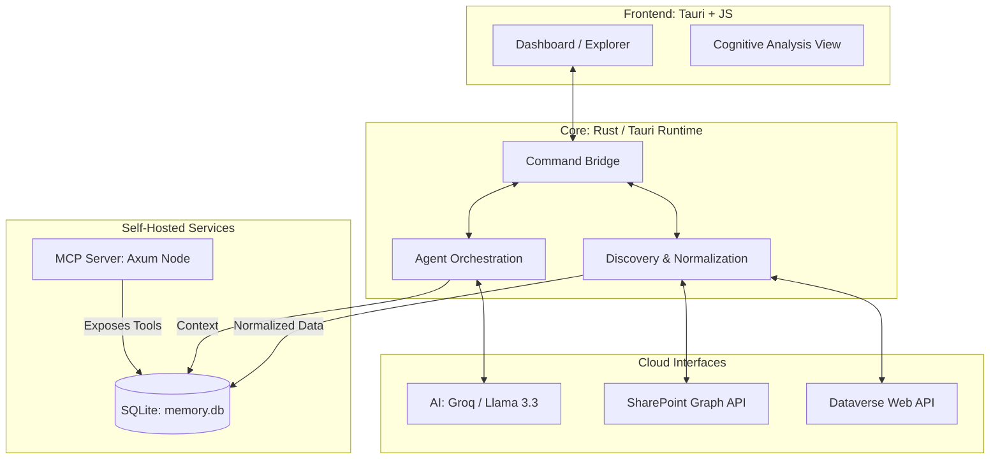

# Business Requirements Document: Nexus Server

**Version**: 1.2.0  
**Status**: Approved / In Implementation  
**Project Lead**: Antigravity (AI Architect)

---

## 1. Executive Summary
Nexus Server is a production-grade, local-first AI workspace designed to eliminate enterprise data fragmentation. By bridging the gap between legacy data silos (SharePoint, Dataverse) and modern AI document intelligence, Nexus Server provides a high-performance unified interface for data discovery and cognitive analysis.

The project leverages a **Rust-based core** for speed and security, integrated with **Tauri** for a premium desktop experience. It enables seamless interaction with enterprise records through standard AI protocols (MCP) and state-of-the-art LLMs.

---

## 2. Project Objectives
- **Data Sovereignty**: Local-first indexing ensures that sensitive enterprise data stays within the organizational perimeter.
- **Unified Discovery**: A "Single Pane of Glass" for heterogeneous sources (M365 list items, documents, CRM records).
- **Agentic Intelligence**: Integrated AI agents capable of performing deep analysis, anomaly detection, and cross-silo summarization.
- **MCP Compliance**: Serving as a Model Context Protocol (MCP) host, allowing other AI tools to leverage the indexed nexus data.

---

## 3. Scope of Work
### 3.1 Included Features
1. **Identity & Soft Gate**: Professional Microsoft Login integration with organizational vetting.
2. **Nexus Explorer**: High-performance data grid with real-time discovery and pagination.
3. **Cognitive Analytics**: 
    - **Quick Summary**: Instant condensation of records.
    - **Deep Neural Analysis**: Comprehensive relational mapping and recommendation generation.
    - **Anomaly Detection**: Algorithmic identification of data inconsistencies.
4. **Data Connectors**: Bi-directional discovery engines for SharePoint and Dataverse.
5. **Infrastructure Control**: Management of the integrated local MCP node (Axum-based).

### 3.2 Out of Scope
- Direct write-back to enterprise systems (Read-only discovery focus for V1).
- Multi-user collaboration on a single local node (Single-user focus).

---

## 4. Technical Architecture

---

## 5. Functional Requirements

### 5.1 Identity & Authentication
- **System soft-gate**: All explorer and analysis features are restricted until a successful Microsoft Login event.
- **OBO (On-Behalf-Of) Ready**: Architecture supports delegated tokens for secure API access.

### 5.2 Nexus Explorer
- **Normalized Grid**: Unified schema for documents (SharePoint) and records (Dataverse).
- **Infinite Scaling**: Paginated data loading from the local `memory.db` to ensure UI responsiveness.
- **Persistence**: Discovery data persists across application restarts in local SQLite storage.

### 5.3 Cognitive Intelligence
- **Streaming Responses**: AI analysis results stream in real-time to the "Intelligence Panel."
- **Mock Insight Layer**: High-quality pre-defined analysis for demo assets to ensure premium user experience without immediate API setup.
- **Contextual Memory**: Local chat history stored to maintain continuity in data-driven conversations.

### 5.4 Data Connectors
- **SharePoint**: Discovery of document libraries and metadata extraction.
- **Dataverse**: Entity-based discovery for CRM and ERP data.
- **Status Monitoring**: Real-time visual feedback on sync progress and record counts.

---

## 6. Non-Functional Requirements
- **Performance**: 
    - UI interaction targeting 60FPS using customized AOS (Animate On Scroll).
    - Database queries under 100ms for standard search operations.
- **Aesthetics**:
    - **Color Palette**: Cyberpunk-influenced "Gold & Black" (Accents: `#FF6A00`, Background: `#0B0B0D`).
    - **UI Standard**: Heavy use of backdrop blurs (Glassmorphism) and rounded corners (24px).
- **Security & Permissions**: 
    - **Permission Control Layer**: Strict enforcement of `ReadOnly` versus `ReadWrite` modes globally managed via `.env` (`PERMISSIONS_MODE`), ensuring default safety.
    - **MCP Tool Security**: All operations requested via the Model Context Protocol (MCP) and internal commands (e.g., file uploads) are evaluated against the active permission layer, effectively preventing unintended enterprise system modifications.
    - Local data encryption at rest (AES-256 standard goal).
    - API keys managed via local `.env` configuration.

---

## 7. Roadmap & Future Scope
- **V1.2**: Implementation of Local Vector Store (RAG) for deep document search.
- **V1.5**: Multi-agent coordination for complex enterprise workflows.
- **V2.0**: Production-ready Microsoft Entra ID PKCE authentication.

---
**End of Document**
